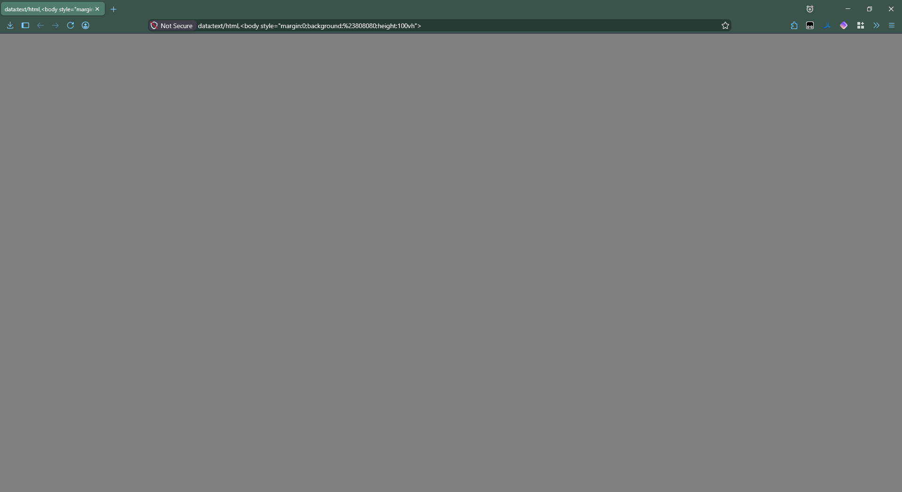

# Seal Mint ❄️🌿

A sleek, glass-morphism Firefox theme with a refreshing minty blur and crisp blue icons.  
Designed for clean aesthetics and comfortable daily use.



## ✨ Features

- **Mint glass panels** – Semi‑transparent toolbars and sidebar with strong backdrop blur.
- **Blue accent icons** – Extension buttons, navigation controls, and menu icons in cool blue (`#7FCCFF`).
- **Readable context menus** – Darker mint background with enough opacity to stay legible.
- **Minimal tab styling** – Subtle highlight on hover and selected tabs, no unnecessary lines.
- **Compact yet spacious sidebar** – Default width 240px (easily adjustable in `:root`).

## 📦 Installation

### 1. Enable user stylesheets in Firefox
- Type `about:config` in the address bar and press Enter.
- Search for `toolkit.legacyUserProfileCustomizations.stylesheets`.
- Set it to `true`.

### 2. Locate your profile folder
- Go to `about:support` → **Profile Folder** → **Open Folder**.
- Inside, look for a folder named `chrome`. If it doesn't exist, create it.

### 3. Copy the theme file
- Download the [`userChrome.css`](userChrome.css) from this repository.
- Place it inside the `chrome` folder.

### 4. Restart Firefox
- Close and reopen Firefox to see the changes.

## 🎨 Customization

All colors and settings are defined at the top of the CSS file inside the `:root` block:

```css
:root {
    --glass-mint: rgba(152, 255, 204, 0.25);   /* Toolbar / tab transparency */
    --menu-dark:  rgba(100, 200, 150, 0.65);   /* Context menu background */
    --icon-blue: #7FCCFF;                      /* Icon color */
    --blur-val: blur(20px);
    --sidebar-width: 240px;
}
